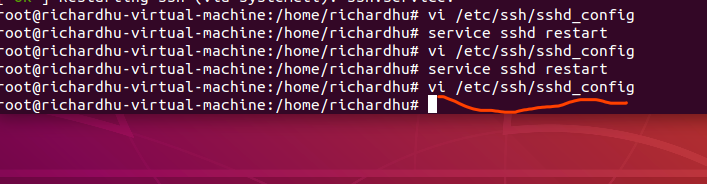
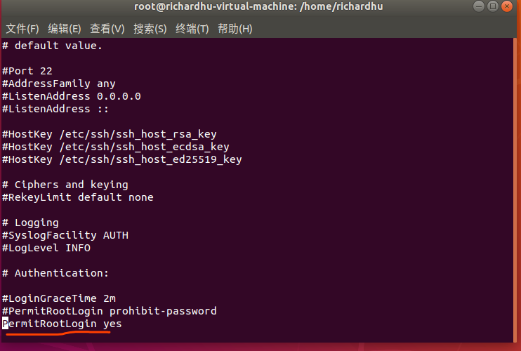

[TOC]
## 更换源
```
#做备份
root@richardhu-virtual-machine:~# cd /etc/apt
root@richardhu-virtual-machine:/etc/apt# ls
apt.conf.d preferences.d sources.list sources.list.d trusted.gpg.d
root@richardhu-virtual-machine:/etc/apt# ls -la
总用量 36
drwxr-xr-x 6 root root 4096 5月 13 2019 .
drwxr-xr-x 126 root root 12288 12月 30 14:34 ..
drwxr-xr-x 2 root root 4096 12月 30 14:31 apt.conf.d
drwxr-xr-x 2 root root 4096 4月 20 2018 preferences.d
-rw-rw-r-- 1 root root 2904 5月 13 2019 sources.list
drwxr-xr-x 2 root root 4096 4月 20 2018 sources.list.d
drwxr-xr-x 2 root root 4096 2月 10 2019 trusted.gpg.d
root@richardhu-virtual-machine:/etc/apt# cp sources.list sources.list_bak
====================================================================================================================

删除原来国外源，增加以下源:
deb [http://mirrors.ustc.edu.cn/ubuntu/](http://mirrors.ustc.edu.cn/ubuntu/) xenial main restricted universe multiverse
deb [http://mirrors.ustc.edu.cn/ubuntu/](http://mirrors.ustc.edu.cn/ubuntu/) xenial-security main restricted universe multiverse
deb [http://mirrors.ustc.edu.cn/ubuntu/](http://mirrors.ustc.edu.cn/ubuntu/) xenial-updates main restricted universe multiverse
deb [http://mirrors.ustc.edu.cn/ubuntu/](http://mirrors.ustc.edu.cn/ubuntu/) xenial-proposed main restricted universe multiverse
deb [http://mirrors.ustc.edu.cn/ubuntu/](http://mirrors.ustc.edu.cn/ubuntu/) xenial-backports main restricted universe multiverse
deb-src [http://mirrors.ustc.edu.cn/ubuntu/](http://mirrors.ustc.edu.cn/ubuntu/) xenial main restricted universe multiverse
deb-src [http://mirrors.ustc.edu.cn/ubuntu/](http://mirrors.ustc.edu.cn/ubuntu/) xenial-security main restricted universe multiverse
deb-src [http://mirrors.ustc.edu.cn/ubuntu/](http://mirrors.ustc.edu.cn/ubuntu/) xenial-updates main restricted universe multiverse
deb-src [http://mirrors.ustc.edu.cn/ubuntu/](http://mirrors.ustc.edu.cn/ubuntu/) xenial-proposed main restricted universe multiverse
deb-src [http://mirrors.ustc.edu.cn/ubuntu/](http://mirrors.ustc.edu.cn/ubuntu/) xenial-backports main restricted universe multiverse
====================================================================================================================

root@richardhu-virtual-machine:/etc/apt# vi sources.list
root@richardhu-virtual-machine:/etc/apt# apt update
获取:1 http://mirrors.ustc.edu.cn/ubuntu xenial InRelease [247 kB]
获取:2 http://mirrors.ustc.edu.cn/ubuntu xenial-security InRelease [109 kB]
获取:3 http://mirrors.ustc.edu.cn/ubuntu xenial-updates InRelease [109 kB]
获取:4 http://mirrors.ustc.edu.cn/ubuntu xenial-proposed InRelease [260 kB]
获取:5 http://mirrors.ustc.edu.cn/ubuntu xenial-backports InRelease [107 kB]
获取:6 http://mirrors.ustc.edu.cn/ubuntu xenial/multiverse Sources [179 kB]
获取:7 http://mirrors.ustc.edu.cn/ubuntu xenial/universe Sources [7,728 kB]
获取:8 http://mirrors.ustc.edu.cn/ubuntu xenial/main Sources [868 kB]
获取:9 http://mirrors.ustc.edu.cn/ubuntu xenial/restricted Sources [4,808 B]
获取:10 http://mirrors.ustc.edu.cn/ubuntu xenial/main amd64 Packages [1,201 kB]
获取:11 http://mirrors.ustc.edu.cn/ubuntu xenial/main i386 Packages [1,196 kB]
获取:12 http://mirrors.ustc.edu.cn/ubuntu xenial/main Translation-en [568 kB]
获取:13 http://mirrors.ustc.edu.cn/ubuntu xenial/main Translation-zh_CN [74.8 kB]
获取:14 http://mirrors.ustc.edu.cn/ubuntu xenial/main amd64 DEP-11 Metadata [733 kB]
获取:15 http://mirrors.ustc.edu.cn/ubuntu xenial/main DEP-11 64x64 Icons [409 kB]
获取:16 http://mirrors.ustc.edu.cn/ubuntu xenial/restricted i386 Packages [8,684 B]
获取:17 http://mirrors.ustc.edu.cn/ubuntu xenial/restricted amd64 Packages [8,344 B]
获取:18 http://mirrors.ustc.edu.cn/ubuntu xenial/restricted Translation-zh_CN [1,652 B]
获取:19 http://mirrors.ustc.edu.cn/ubuntu xenial/restricted Translation-en [2,908 B]
获取:20 http://mirrors.ustc.edu.cn/ubuntu xenial/restricted amd64 DEP-11 Metadata [186 B]
获取:21 http://mirrors.ustc.edu.cn/ubuntu xenial/universe amd64 Packages [7,532 kB]
获取:22 http://mirrors.ustc.edu.cn/ubuntu xenial/universe i386 Packages [7,512 kB]
获取:23 http://mirrors.ustc.edu.cn/ubuntu xenial/universe Translation-zh_CN [172 kB]
获取:24 http://mirrors.ustc.edu.cn/ubuntu xenial/universe Translation-en [4,354 kB]
获取:25 http://mirrors.ustc.edu.cn/ubuntu xenial/universe amd64 DEP-11 Metadata [3,410 kB]
获取:26 http://mirrors.ustc.edu.cn/ubuntu xenial/universe DEP-11 64x64 Icons [7,448 kB]
获取:27 http://mirrors.ustc.edu.cn/ubuntu xenial/multiverse i386 Packages [140 kB]
获取:28 http://mirrors.ustc.edu.cn/ubuntu xenial/multiverse amd64 Packages [144 kB]
获取:29 http://mirrors.ustc.edu.cn/ubuntu xenial/multiverse Translation-zh_CN [4,984 B]
获取:30 http://mirrors.ustc.edu.cn/ubuntu xenial/multiverse Translation-en [106 kB]
获取:31 http://mirrors.ustc.edu.cn/ubuntu xenial/multiverse amd64 DEP-11 Metadata [63.8 kB]
获取:32 http://mirrors.ustc.edu.cn/ubuntu xenial/multiverse DEP-11 64x64 Icons [230 kB]
获取:33 http://mirrors.ustc.edu.cn/ubuntu xenial-security/restricted Sources [2,116 B]
获取:34 http://mirrors.ustc.edu.cn/ubuntu xenial-security/multiverse Sources [3,408 B]
获取:35 http://mirrors.ustc.edu.cn/ubuntu xenial-security/main Sources [158 kB]
获取:36 http://mirrors.ustc.edu.cn/ubuntu xenial-security/universe Sources [115 kB]
获取:37 http://mirrors.ustc.edu.cn/ubuntu xenial-security/main amd64 Packages [797 kB]
获取:38 http://mirrors.ustc.edu.cn/ubuntu xenial-security/main i386 Packages [623 kB]
获取:39 http://mirrors.ustc.edu.cn/ubuntu xenial-security/main Translation-en [306 kB]
获取:40 http://mirrors.ustc.edu.cn/ubuntu xenial-security/main amd64 DEP-11 Metadata [74.8 kB]
获取:41 http://mirrors.ustc.edu.cn/ubuntu xenial-security/main DEP-11 48x48 Icons [17.6 kB]
获取:42 http://mirrors.ustc.edu.cn/ubuntu xenial-security/main DEP-11 64x64 Icons [79.6 kB]
获取:43 http://mirrors.ustc.edu.cn/ubuntu xenial-security/restricted amd64 Packages [7,204 B]
获取:44 http://mirrors.ustc.edu.cn/ubuntu xenial-security/restricted i386 Packages [7,224 B]
获取:45 http://mirrors.ustc.edu.cn/ubuntu xenial-security/restricted Translation-en [2,152 B]
获取:46 http://mirrors.ustc.edu.cn/ubuntu xenial-security/restricted amd64 DEP-11 Metadata [200 B]
获取:47 http://mirrors.ustc.edu.cn/ubuntu xenial-security/universe i386 Packages [402 kB]
获取:48 http://mirrors.ustc.edu.cn/ubuntu xenial-security/universe amd64 Packages [466 kB]
获取:49 http://mirrors.ustc.edu.cn/ubuntu xenial-security/universe Translation-en [192 kB]
获取:50 http://mirrors.ustc.edu.cn/ubuntu xenial-security/universe amd64 DEP-11 Metadata [124 kB]
获取:51 http://mirrors.ustc.edu.cn/ubuntu xenial-security/universe DEP-11 48x48 Icons [5,919 B]
获取:52 http://mirrors.ustc.edu.cn/ubuntu xenial-security/universe DEP-11 64x64 Icons [194 kB]
获取:53 http://mirrors.ustc.edu.cn/ubuntu xenial-security/multiverse amd64 Packages [5,728 B]
获取:54 http://mirrors.ustc.edu.cn/ubuntu xenial-security/multiverse i386 Packages [5,888 B]
获取:55 http://mirrors.ustc.edu.cn/ubuntu xenial-security/multiverse Translation-en [2,708 B]
获取:56 http://mirrors.ustc.edu.cn/ubuntu xenial-security/multiverse amd64 DEP-11 Metadata [2,464 B]
获取:57 http://mirrors.ustc.edu.cn/ubuntu xenial-security/multiverse DEP-11 48x48 Icons [29 B]
获取:58 http://mirrors.ustc.edu.cn/ubuntu xenial-security/multiverse DEP-11 64x64 Icons [2,638 B]
获取:59 http://mirrors.ustc.edu.cn/ubuntu xenial-updates/main Sources [344 kB]
获取:60 http://mirrors.ustc.edu.cn/ubuntu xenial-updates/multiverse Sources [8,752 B]
获取:61 http://mirrors.ustc.edu.cn/ubuntu xenial-updates/universe Sources [264 kB]
获取:62 http://mirrors.ustc.edu.cn/ubuntu xenial-updates/restricted Sources [2,536 B]
获取:63 http://mirrors.ustc.edu.cn/ubuntu xenial-updates/main i386 Packages [888 kB]
获取:64 http://mirrors.ustc.edu.cn/ubuntu xenial-updates/main amd64 Packages [1,082 kB]
获取:65 http://mirrors.ustc.edu.cn/ubuntu xenial-updates/main Translation-en [416 kB]
获取:66 http://mirrors.ustc.edu.cn/ubuntu xenial-updates/main amd64 DEP-11 Metadata [322 kB]
获取:67 http://mirrors.ustc.edu.cn/ubuntu xenial-updates/main DEP-11 48x48 Icons [17.6 kB]
获取:68 http://mirrors.ustc.edu.cn/ubuntu xenial-updates/main DEP-11 64x64 Icons [236 kB]
获取:69 http://mirrors.ustc.edu.cn/ubuntu xenial-updates/restricted amd64 Packages [7,616 B]
获取:70 http://mirrors.ustc.edu.cn/ubuntu xenial-updates/restricted i386 Packages [7,580 B]
获取:71 http://mirrors.ustc.edu.cn/ubuntu xenial-updates/restricted Translation-en [2,272 B]
获取:72 http://mirrors.ustc.edu.cn/ubuntu xenial-updates/restricted amd64 DEP-11 Metadata [157 B]
获取:73 http://mirrors.ustc.edu.cn/ubuntu xenial-updates/universe i386 Packages [700 kB]
获取:74 http://mirrors.ustc.edu.cn/ubuntu xenial-updates/universe amd64 Packages [771 kB]
获取:75 http://mirrors.ustc.edu.cn/ubuntu xenial-updates/universe Translation-en [324 kB]
获取:76 http://mirrors.ustc.edu.cn/ubuntu xenial-updates/universe amd64 DEP-11 Metadata [274 kB]
获取:77 http://mirrors.ustc.edu.cn/ubuntu xenial-updates/universe DEP-11 48x48 Icons [32.0 kB]
获取:78 http://mirrors.ustc.edu.cn/ubuntu xenial-updates/universe DEP-11 64x64 Icons [411 kB]
获取:79 http://mirrors.ustc.edu.cn/ubuntu xenial-updates/multiverse amd64 Packages [16.8 kB]
获取:80 http://mirrors.ustc.edu.cn/ubuntu xenial-updates/multiverse i386 Packages [15.9 kB]
获取:81 http://mirrors.ustc.edu.cn/ubuntu xenial-updates/multiverse Translation-en [8,468 B]
获取:82 http://mirrors.ustc.edu.cn/ubuntu xenial-updates/multiverse amd64 DEP-11 Metadata [5,976 B]
获取:83 http://mirrors.ustc.edu.cn/ubuntu xenial-updates/multiverse DEP-11 48x48 Icons [29 B]
获取:84 http://mirrors.ustc.edu.cn/ubuntu xenial-updates/multiverse DEP-11 64x64 Icons [14.3 kB]
获取:85 http://mirrors.ustc.edu.cn/ubuntu xenial-proposed/main Sources [16.8 kB]
获取:86 http://mirrors.ustc.edu.cn/ubuntu xenial-proposed/universe Sources [5,740 B]
获取:87 http://mirrors.ustc.edu.cn/ubuntu xenial-proposed/main amd64 Packages [54.5 kB]
获取:88 http://mirrors.ustc.edu.cn/ubuntu xenial-proposed/main i386 Packages [39.4 kB]
获取:89 http://mirrors.ustc.edu.cn/ubuntu xenial-proposed/main Translation-en [20.8 kB]
获取:90 http://mirrors.ustc.edu.cn/ubuntu xenial-proposed/main Translation-zh_CN [74.8 kB]
获取:91 http://mirrors.ustc.edu.cn/ubuntu xenial-proposed/main amd64 DEP-11 Metadata [208 B]
获取:92 http://mirrors.ustc.edu.cn/ubuntu xenial-proposed/main DEP-11 48x48 Icons [29 B]
获取:93 http://mirrors.ustc.edu.cn/ubuntu xenial-proposed/main DEP-11 64x64 Icons [29 B]
获取:94 http://mirrors.ustc.edu.cn/ubuntu xenial-proposed/restricted Translation-zh_CN [1,652 B]
获取:95 http://mirrors.ustc.edu.cn/ubuntu xenial-proposed/restricted amd64 DEP-11 Metadata [201 B]
获取:96 http://mirrors.ustc.edu.cn/ubuntu xenial-proposed/universe i386 Packages [6,688 B]
获取:97 http://mirrors.ustc.edu.cn/ubuntu xenial-proposed/universe amd64 Packages [8,768 B]
获取:98 http://mirrors.ustc.edu.cn/ubuntu xenial-proposed/universe Translation-en [6,844 B]
获取:99 http://mirrors.ustc.edu.cn/ubuntu xenial-proposed/universe Translation-zh_CN [172 kB]
获取:100 http://mirrors.ustc.edu.cn/ubuntu xenial-proposed/universe amd64 DEP-11 Metadata [6,052 B]
获取:101 http://mirrors.ustc.edu.cn/ubuntu xenial-proposed/universe DEP-11 48x48 Icons [29 B]
获取:102 http://mirrors.ustc.edu.cn/ubuntu xenial-proposed/universe DEP-11 64x64 Icons [6,288 B]
获取:103 http://mirrors.ustc.edu.cn/ubuntu xenial-proposed/multiverse Translation-zh_CN [4,984 B]
获取:104 http://mirrors.ustc.edu.cn/ubuntu xenial-proposed/multiverse amd64 DEP-11 Metadata [2,468 B]
获取:105 http://mirrors.ustc.edu.cn/ubuntu xenial-proposed/multiverse DEP-11 48x48 Icons [29 B]
获取:106 http://mirrors.ustc.edu.cn/ubuntu xenial-proposed/multiverse DEP-11 64x64 Icons [2,638 B]
获取:107 http://mirrors.ustc.edu.cn/ubuntu xenial-backports/universe Sources [7,120 B]
获取:108 http://mirrors.ustc.edu.cn/ubuntu xenial-backports/main Sources [4,848 B]
获取:109 http://mirrors.ustc.edu.cn/ubuntu xenial-backports/main i386 Packages [7,288 B]
获取:110 http://mirrors.ustc.edu.cn/ubuntu xenial-backports/main amd64 Packages [7,280 B]
获取:111 http://mirrors.ustc.edu.cn/ubuntu xenial-backports/main Translation-en [4,456 B]
获取:112 http://mirrors.ustc.edu.cn/ubuntu xenial-backports/main amd64 DEP-11 Metadata [3,324 B]
获取:113 http://mirrors.ustc.edu.cn/ubuntu xenial-backports/main DEP-11 48x48 Icons [29 B]
获取:114 http://mirrors.ustc.edu.cn/ubuntu xenial-backports/main DEP-11 64x64 Icons [29 B]
获取:115 http://mirrors.ustc.edu.cn/ubuntu xenial-backports/restricted amd64 DEP-11 Metadata [194 B]
获取:116 http://mirrors.ustc.edu.cn/ubuntu xenial-backports/universe amd64 Packages [8,064 B]
获取:117 http://mirrors.ustc.edu.cn/ubuntu xenial-backports/universe i386 Packages [7,744 B]
获取:118 http://mirrors.ustc.edu.cn/ubuntu xenial-backports/universe Translation-en [4,328 B]
获取:119 http://mirrors.ustc.edu.cn/ubuntu xenial-backports/universe amd64 DEP-11 Metadata [5,328 B]
获取:120 http://mirrors.ustc.edu.cn/ubuntu xenial-backports/universe DEP-11 48x48 Icons [29 B]
获取:121 http://mirrors.ustc.edu.cn/ubuntu xenial-backports/universe DEP-11 64x64 Icons [1,789 B]
获取:122 http://mirrors.ustc.edu.cn/ubuntu xenial-backports/multiverse amd64 DEP-11 Metadata [216 B]
获取:123 http://mirrors.ustc.edu.cn/ubuntu xenial-backports/multiverse DEP-11 64x64 Icons [29 B]
已下载 55.2 MB，耗时 1分 11秒 (779 kB/s)
正在读取软件包列表... 完成
正在分析软件包的依赖关系树
正在读取状态信息... 完成
有 3 个软件包可以升级。请执行 ‘apt list --upgradable’ 来查看它们。


```
## 问题1(ssh连接问题):
```
$ssh -p 22 root@172.16.134.138
root@172.16.134.138's password:
Permission denied, please try again.
root@172.16.134.138's password:
Permission denied, please try again.
root@172.16.134.138's password:

```
解决


再重启服务:
```
service sshd restart

```
## 问题2并继续安装
```
root@richardhu-virtual-machine:/etc/apt# apt install vim
正在读取软件包列表... 完成
正在分析软件包的依赖关系树
正在读取状态信息... 完成
有一些软件包无法被安装。如果您用的是 unstable 发行版，这也许是
因为系统无法达到您要求的状态造成的。该版本中可能会有一些您需要的软件
包尚未被创建或是它们已被从新到(Incoming)目录移出。
下列信息可能会对解决问题有所帮助：

下列软件包有未满足的依赖关系：
 vim : 依赖: vim-common (= 2:7.4.1689-3ubuntu1.3) 但是 2:8.0.1453-1ubuntu1.1 正要被安装
E: 无法修正错误，因为您要求某些软件包保持现状，就是它们破坏了软件包间的依赖关系。
```
解决:
https://blog.csdn.net/fcb_campnou/article/details/44851691
```
sudo apt-get purge vim-common
sudo apt-get update
sudo apt-get upgrade
sudo apt-get install vim
====================================================================================================================
#命令1
root@richardhu-virtual-machine:/etc/apt# apt-get purge vim-common
正在读取软件包列表... 完成
正在分析软件包的依赖关系树
正在读取状态信息... 完成
下列软件包是自动安装的并且现在不需要了：
  linux-headers-4.18.0-15 linux-headers-4.18.0-15-generic linux-image-4.18.0-15-generic
  linux-modules-4.18.0-15-generic linux-modules-extra-4.18.0-15-generic
使用'apt autoremove'来卸载它(它们)。
下列软件包将被【卸载】：
  ubuntu-minimal* vim-common* vim-tiny*
升级了 0 个软件包，新安装了 0 个软件包，要卸载 3 个软件包，有 3 个软件包未被升级。
解压缩后将会空出 1,687 kB 的空间。
您希望继续执行吗？ [Y/n] Y
(正在读取数据库 ... 系统当前共安装有 200714 个文件和目录。)
正在卸载 ubuntu-minimal (1.417) ...
正在卸载 vim-tiny (2:8.0.1453-1ubuntu1.1) ...
正在卸载 vim-common (2:8.0.1453-1ubuntu1.1) ...
正在处理用于 mime-support (3.60ubuntu1) 的触发器 ...
正在处理用于 desktop-file-utils (0.23-1ubuntu3.18.04.2) 的触发器 ...
正在处理用于 man-db (2.8.3-2ubuntu0.1) 的触发器 ...
正在处理用于 gnome-menus (3.13.3-11ubuntu1.1) 的触发器 ...
正在处理用于 hicolor-icon-theme (0.17-2) 的触发器 ...
(正在读取数据库 ... 系统当前共安装有 200649 个文件和目录。)
正在清除 vim-tiny (2:8.0.1453-1ubuntu1.1) 的配置文件 ...
正在清除 vim-common (2:8.0.1453-1ubuntu1.1) 的配置文件 ...
====================================================================================================================
root@richardhu-virtual-machine:/etc/apt# apt-get update
命中:1 http://mirrors.ustc.edu.cn/ubuntu xenial InRelease
命中:2 http://mirrors.ustc.edu.cn/ubuntu xenial-security InRelease
命中:3 http://mirrors.ustc.edu.cn/ubuntu xenial-updates InRelease
命中:4 http://mirrors.ustc.edu.cn/ubuntu xenial-proposed InRelease
命中:5 http://mirrors.ustc.edu.cn/ubuntu xenial-backports InRelease
正在读取软件包列表... 完成
====================================================================================================================
root@richardhu-virtual-machine:/etc/apt# apt-get upgrade
正在读取软件包列表... 完成
正在分析软件包的依赖关系树
正在读取状态信息... 完成
正在计算更新... 完成
下列软件包是自动安装的并且现在不需要了：
  linux-headers-4.18.0-15 linux-headers-4.18.0-15-generic linux-image-4.18.0-15-generic
  linux-modules-4.18.0-15-generic linux-modules-extra-4.18.0-15-generic
使用'apt autoremove'来卸载它(它们)。
下列软件包将被升级：
  gir1.2-snapd-1 libsnapd-glib1 snapd
升级了 3 个软件包，新安装了 0 个软件包，要卸载 0 个软件包，有 0 个软件包未被升级。
需要下载 13.3 MB 的归档。
解压缩后将会空出 2,281 kB 的空间。
您希望继续执行吗？ [Y/n] Y
获取:1 http://mirrors.ustc.edu.cn/ubuntu xenial-proposed/main amd64 gir1.2-snapd-1 amd64 1.49-0ubuntu0.16.04.1 [12.5 kB]
获取:2 http://mirrors.ustc.edu.cn/ubuntu xenial-proposed/main amd64 libsnapd-glib1 amd64 1.49-0ubuntu0.16.04.1 [87.4 kB]
获取:3 http://mirrors.ustc.edu.cn/ubuntu xenial-proposed/main amd64 snapd amd64 2.42.1 [13.2 MB]
已下载 13.3 MB，耗时 55秒 (240 kB/s)
(正在读取数据库 ... 系统当前共安装有 200647 个文件和目录。)
正准备解包 .../gir1.2-snapd-1_1.49-0ubuntu0.16.04.1_amd64.deb ...
正在将 gir1.2-snapd-1:amd64 (1.49-0ubuntu0.16.04.1) 解包到 (1.43-0ubuntu0.18.04.1) 上 ...
正准备解包 .../libsnapd-glib1_1.49-0ubuntu0.16.04.1_amd64.deb ...
正在将 libsnapd-glib1:amd64 (1.49-0ubuntu0.16.04.1) 解包到 (1.43-0ubuntu0.18.04.1) 上 ...
正准备解包 .../snapd_2.42.1_amd64.deb ...
正在将 snapd (2.42.1) 解包到 (2.37.4+18.04.1) 上 ...
正在处理用于 mime-support (3.60ubuntu1) 的触发器 ...
正在处理用于 desktop-file-utils (0.23-1ubuntu3.18.04.2) 的触发器 ...
正在设置 snapd (2.42.1) ...
正在安装新版本配置文件 /etc/apparmor.d/usr.lib.snapd.snap-confine.real ...
正在安装新版本配置文件 /etc/xdg/autostart/snap-userd-autostart.desktop ...
snapd.failure.service is a disabled or a static unit, not starting it.
snapd.snap-repair.service is a disabled or a static unit, not starting it.
正在设置 libsnapd-glib1:amd64 (1.49-0ubuntu0.16.04.1) ...
正在处理用于 libc-bin (2.27-3ubuntu1) 的触发器 ...
正在处理用于 man-db (2.8.3-2ubuntu0.1) 的触发器 ...
正在设置 gir1.2-snapd-1:amd64 (1.49-0ubuntu0.16.04.1) ...
正在处理用于 gnome-menus (3.13.3-11ubuntu1.1) 的触发器 ...
====================================================================================================================

root@richardhu-virtual-machine:/etc/apt# apt-get install vim
正在读取软件包列表... 完成
正在分析软件包的依赖关系树
正在读取状态信息... 完成
下列软件包是自动安装的并且现在不需要了：
  linux-headers-4.18.0-15 linux-headers-4.18.0-15-generic linux-image-4.18.0-15-generic
  linux-modules-4.18.0-15-generic linux-modules-extra-4.18.0-15-generic
使用'apt autoremove'来卸载它(它们)。
将会同时安装下列软件：
  libpython3.5 libpython3.5-minimal libpython3.5-stdlib libreadline6 vim-common vim-runtime
建议安装：
  ctags vim-doc vim-scripts vim-gnome-py2 | vim-gtk-py2 | vim-gtk3-py2 | vim-athena-py2 | vim-nox-py2
下列软件包将被【卸载】：
  xxd
下列【新】软件包将被安装：
  libpython3.5 libpython3.5-minimal libpython3.5-stdlib libreadline6 vim vim-common vim-runtime
升级了 0 个软件包，新安装了 7 个软件包，要卸载 1 个软件包，有 0 个软件包未被升级。
需要下载 10.5 MB 的归档。
解压缩后会消耗 49.1 MB 的额外空间。
您希望继续执行吗？ [Y/n] Y
获取:1 http://mirrors.ustc.edu.cn/ubuntu xenial-security/main amd64 libpython3.5-minimal amd64 3.5.2-2ubuntu0~16.04.9 [524 kB]
获取:2 http://mirrors.ustc.edu.cn/ubuntu xenial/main amd64 libreadline6 amd64 6.3-8ubuntu2 [117 kB]
获取:3 http://mirrors.ustc.edu.cn/ubuntu xenial-security/main amd64 libpython3.5-stdlib amd64 3.5.2-2ubuntu0~16.04.9 [2,137 kB]
获取:4 http://mirrors.ustc.edu.cn/ubuntu xenial-security/main amd64 vim-common amd64 2:7.4.1689-3ubuntu1.3 [103 kB]
获取:5 http://mirrors.ustc.edu.cn/ubuntu xenial-security/main amd64 libpython3.5 amd64 3.5.2-2ubuntu0~16.04.9 [1,360 kB]
获取:6 http://mirrors.ustc.edu.cn/ubuntu xenial-security/main amd64 vim-runtime all 2:7.4.1689-3ubuntu1.3 [5,179 kB]
获取:7 http://mirrors.ustc.edu.cn/ubuntu xenial-security/main amd64 vim amd64 2:7.4.1689-3ubuntu1.3 [1,036 kB]
已下载 10.5 MB，耗时 47秒 (225 kB/s)
(正在读取数据库 ... 系统当前共安装有 200649 个文件和目录。)
正在卸载 xxd (2:8.0.1453-1ubuntu1.1) ...
正在选中未选择的软件包 libpython3.5-minimal:amd64。
(正在读取数据库 ... 系统当前共安装有 200639 个文件和目录。)
正准备解包 .../0-libpython3.5-minimal_3.5.2-2ubuntu0~16.04.9_amd64.deb ...
正在解包 libpython3.5-minimal:amd64 (3.5.2-2ubuntu0~16.04.9) ...
正在选中未选择的软件包 libreadline6:amd64。
正准备解包 .../1-libreadline6_6.3-8ubuntu2_amd64.deb ...
正在解包 libreadline6:amd64 (6.3-8ubuntu2) ...
正在选中未选择的软件包 libpython3.5-stdlib:amd64。
正准备解包 .../2-libpython3.5-stdlib_3.5.2-2ubuntu0~16.04.9_amd64.deb ...
正在解包 libpython3.5-stdlib:amd64 (3.5.2-2ubuntu0~16.04.9) ...
正在选中未选择的软件包 vim-common。
正准备解包 .../3-vim-common_2%3a7.4.1689-3ubuntu1.3_amd64.deb ...
正在解包 vim-common (2:7.4.1689-3ubuntu1.3) ...
正在选中未选择的软件包 libpython3.5:amd64。
正准备解包 .../4-libpython3.5_3.5.2-2ubuntu0~16.04.9_amd64.deb ...
正在解包 libpython3.5:amd64 (3.5.2-2ubuntu0~16.04.9) ...
正在选中未选择的软件包 vim-runtime。
正准备解包 .../5-vim-runtime_2%3a7.4.1689-3ubuntu1.3_all.deb ...
正在添加 vim-runtime 导致 /usr/share/vim/vim74/doc/help.txt 转移到 /usr/share/vim/vim74/doc/help.txt.vim-tiny
正在添加 vim-runtime 导致 /usr/share/vim/vim74/doc/tags 转移到 /usr/share/vim/vim74/doc/tags.vim-tiny
正在解包 vim-runtime (2:7.4.1689-3ubuntu1.3) ...
正在选中未选择的软件包 vim。
正准备解包 .../6-vim_2%3a7.4.1689-3ubuntu1.3_amd64.deb ...
正在解包 vim (2:7.4.1689-3ubuntu1.3) ...
正在处理用于 mime-support (3.60ubuntu1) 的触发器 ...
正在处理用于 desktop-file-utils (0.23-1ubuntu3.18.04.2) 的触发器 ...
正在处理用于 libc-bin (2.27-3ubuntu1) 的触发器 ...
正在设置 vim-common (2:7.4.1689-3ubuntu1.3) ...
正在处理用于 man-db (2.8.3-2ubuntu0.1) 的触发器 ...
正在设置 vim-runtime (2:7.4.1689-3ubuntu1.3) ...
正在处理用于 gnome-menus (3.13.3-11ubuntu1.1) 的触发器 ...
正在处理用于 hicolor-icon-theme (0.17-2) 的触发器 ...
正在设置 libreadline6:amd64 (6.3-8ubuntu2) ...
正在设置 libpython3.5-minimal:amd64 (3.5.2-2ubuntu0~16.04.9) ...
正在设置 libpython3.5-stdlib:amd64 (3.5.2-2ubuntu0~16.04.9) ...
正在设置 libpython3.5:amd64 (3.5.2-2ubuntu0~16.04.9) ...
正在设置 vim (2:7.4.1689-3ubuntu1.3) ...
update-alternatives: 使用 /usr/bin/vim.basic 来在自动模式中提供 /usr/bin/vim (vim)
update-alternatives: 使用 /usr/bin/vim.basic 来在自动模式中提供 /usr/bin/vimdiff (vimdiff)
update-alternatives: 使用 /usr/bin/vim.basic 来在自动模式中提供 /usr/bin/rvim (rvim)
update-alternatives: 使用 /usr/bin/vim.basic 来在自动模式中提供 /usr/bin/rview (rview)
update-alternatives: 使用 /usr/bin/vim.basic 来在自动模式中提供 /usr/bin/vi (vi)
update-alternatives: 使用 /usr/bin/vim.basic 来在自动模式中提供 /usr/bin/view (view)
update-alternatives: 使用 /usr/bin/vim.basic 来在自动模式中提供 /usr/bin/ex (ex)
正在处理用于 libc-bin (2.27-3ubuntu1) 的触发器 ...
root@richardhu-virtual-machine:/etc/apt# which vim
/usr/bin/vim
====================================================================================================================
root@richardhu-virtual-machine:/etc/apt# apt install mysql-server mysql-client
正在读取软件包列表... 完成
正在分析软件包的依赖关系树
正在读取状态信息... 完成
下列软件包是自动安装的并且现在不需要了：
  linux-headers-4.18.0-15 linux-headers-4.18.0-15-generic linux-image-4.18.0-15-generic
  linux-modules-4.18.0-15-generic linux-modules-extra-4.18.0-15-generic
使用'apt autoremove'来卸载它(它们)。
正准备解包 .../mysql-server-5.7_5.7.28-0ubuntu0.16.04.2_amd64.deb ...
正在解包 mysql-server-5.7 (5.7.28-0ubuntu0.16.04.2) ...
正在选中未选择的软件包 libhtml-template-perl。
正准备解包 .../libhtml-template-perl_2.95-2_all.deb ...
正在解包 libhtml-template-perl (2.95-2) ...
正在选中未选择的软件包 mysql-client。
正准备解包 .../mysql-client_5.7.28-0ubuntu0.16.04.2_all.deb ...
正在解包 mysql-client (5.7.28-0ubuntu0.16.04.2) ...
正在选中未选择的软件包 mysql-server。
正准备解包 .../mysql-server_5.7.28-0ubuntu0.16.04.2_all.deb ...
正在解包 mysql-server (5.7.28-0ubuntu0.16.04.2) ...
正在设置 libhtml-template-perl (2.95-2) ...
正在处理用于 ureadahead (0.100.0-20) 的触发器 ...
正在处理用于 libc-bin (2.27-3ubuntu1) 的触发器 ...
正在设置 libaio1:amd64 (0.3.110-2) ...
正在设置 libevent-core-2.0-5:amd64 (2.0.21-stable-2ubuntu0.16.04.1) ...
正在处理用于 systemd (237-3ubuntu10.29) 的触发器 ...
正在处理用于 man-db (2.8.3-2ubuntu0.1) 的触发器 ...
正在设置 insserv (1.14.0-5ubuntu3) ...
正在设置 mysql-client-core-5.7 (5.7.28-0ubuntu0.16.04.2) ...
正在设置 mysql-server-core-5.7 (5.7.28-0ubuntu0.16.04.2) ...
正在设置 sysv-rc (2.88dsf-59.3ubuntu2) ...
正在设置 mysql-client (5.7.28-0ubuntu0.16.04.2) ...
正在设置 mysql-server-5.7 (5.7.28-0ubuntu0.16.04.2) ...
update-alternatives: 使用 /etc/mysql/mysql.cnf 来在自动模式中提供 /etc/mysql/my.cnf (my.cnf)
Renaming removed key_buffer and myisam-recover options (if present)
Created symlink /etc/systemd/system/multi-user.target.wants/mysql.service → /lib/systemd/system/mysql.service.
正在设置 mysql-server (5.7.28-0ubuntu0.16.04.2) ...
正在处理用于 libc-bin (2.27-3ubuntu1) 的触发器 ...
正在处理用于 systemd (237-3ubuntu10.29) 的触发器 ...
正在处理用于 ureadahead (0.100.0-20) 的触发器 ...
====================================================================================================================
上面安装的中途会叫你设置密码,这里设置为root
root@richardhu-virtual-machine:/etc/apt# mysql -uroot -p
Enter password:
Welcome to the MySQL monitor. Commands end with ; or \g.
Your MySQL connection id is 4
Server version: 5.7.28-0ubuntu0.16.04.2 (Ubuntu)

Copyright (c) 2000, 2019, Oracle and/or its affiliates. All rights reserved.

Oracle is a registered trademark of Oracle Corporation and/or its
affiliates. Other names may be trademarks of their respective
owners.

Type 'help;' or '\h' for help. Type '\c' to clear the current input statement.

mysql> show databases;
+--------------------+
| Database |
+--------------------+
| information_schema |
| mysql |
| performance_schema |
| sys |
+--------------------+
4 rows in set (0.00 sec)

mysql> exit
Bye
====================================================================================================================

```

## 问题3(安装telenet的问题)
```
root@richardhu-virtual-machine:/etc/apt# apt install telent
正在读取软件包列表... 完成
正在分析软件包的依赖关系树
正在读取状态信息... 完成
E: 无法定位软件包 telent
root@richardhu-virtual-machine:/etc/apt# apt-get update
命中:1 http://mirrors.ustc.edu.cn/ubuntu xenial InRelease
命中:2 http://mirrors.ustc.edu.cn/ubuntu xenial-security InRelease
命中:3 http://mirrors.ustc.edu.cn/ubuntu xenial-updates InRelease
命中:4 http://mirrors.ustc.edu.cn/ubuntu xenial-proposed InRelease
命中:5 http://mirrors.ustc.edu.cn/ubuntu xenial-backports InRelease
正在读取软件包列表... 完成
root@richardhu-virtual-machine:/etc/apt# apt install telent
正在读取软件包列表... 完成
正在分析软件包的依赖关系树
正在读取状态信息... 完成
E: 无法定位软件包 telent

```
问题的解决:
https://www.jianshu.com/p/1c6d99e078b6
```
apt-get install openbsd-inetd

apt-get install telnetd


```
过程如下:
```
root@richardhu-virtual-machine:/etc/apt# apt install openbsd-inetd
正在读取软件包列表... 完成
正在分析软件包的依赖关系树
正在读取状态信息... 完成
下列软件包是自动安装的并且现在不需要了：
  linux-headers-4.18.0-15 linux-headers-4.18.0-15-generic linux-image-4.18.0-15-generic
  linux-modules-4.18.0-15-generic linux-modules-extra-4.18.0-15-generic
使用'apt autoremove'来卸载它(它们)。
将会同时安装下列软件：
  tcpd
下列【新】软件包将被安装：
  openbsd-inetd tcpd
升级了 0 个软件包，新安装了 2 个软件包，要卸载 0 个软件包，有 0 个软件包未被升级。
需要下载 49.2 kB 的归档。
解压缩后会消耗 201 kB 的额外空间。
您希望继续执行吗？ [Y/n] Y
获取:1 http://mirrors.ustc.edu.cn/ubuntu xenial/main amd64 tcpd amd64 7.6.q-25 [23.0 kB]
获取:2 http://mirrors.ustc.edu.cn/ubuntu xenial/main amd64 openbsd-inetd amd64 0.20140418-2 [26.2 kB]
已下载 49.2 kB，耗时 25秒 (1,998 B/s)
正在选中未选择的软件包 tcpd。
(正在读取数据库 ... 系统当前共安装有 203611 个文件和目录。)
正准备解包 .../tcpd_7.6.q-25_amd64.deb ...
正在解包 tcpd (7.6.q-25) ...
正在选中未选择的软件包 openbsd-inetd。
正准备解包 .../openbsd-inetd_0.20140418-2_amd64.deb ...
正在解包 openbsd-inetd (0.20140418-2) ...
正在处理用于 ureadahead (0.100.0-20) 的触发器 ...
正在设置 tcpd (7.6.q-25) ...
正在设置 openbsd-inetd (0.20140418-2) ...
Created symlink /etc/systemd/system/multi-user.target.wants/inetd.service → /lib/systemd/system/inetd.service.
正在处理用于 systemd (237-3ubuntu10.29) 的触发器 ...
正在处理用于 man-db (2.8.3-2ubuntu0.1) 的触发器 ...
正在处理用于 ureadahead (0.100.0-20) 的触发器 ...
====================================================================================================================
root@richardhu-virtual-machine:/etc/apt# apt-get install telnetd
正在读取软件包列表... 完成
正在分析软件包的依赖关系树
正在读取状态信息... 完成
下列软件包是自动安装的并且现在不需要了：
  linux-headers-4.18.0-15 linux-headers-4.18.0-15-generic linux-image-4.18.0-15-generic
  linux-modules-4.18.0-15-generic linux-modules-extra-4.18.0-15-generic
使用'apt autoremove'来卸载它(它们)。
下列【新】软件包将被安装：
  telnetd
升级了 0 个软件包，新安装了 1 个软件包，要卸载 0 个软件包，有 0 个软件包未被升级。
需要下载 37.7 kB 的归档。
解压缩后会消耗 138 kB 的额外空间。
获取:1 http://mirrors.ustc.edu.cn/ubuntu xenial/universe amd64 telnetd amd64 0.17-40 [37.7 kB]
已下载 37.7 kB，耗时 32秒 (1,176 B/s)
正在选中未选择的软件包 telnetd。
(正在读取数据库 ... 系统当前共安装有 203631 个文件和目录。)
正准备解包 .../telnetd_0.17-40_amd64.deb ...
正在解包 telnetd (0.17-40) ...
正在设置 telnetd (0.17-40) ...
正在将用户“telnetd”加入到“utmp”组中
正在处理用于 man-db (2.8.3-2ubuntu0.1) 的触发器 ...
====================================================================================================================

root@richardhu-virtual-machine:/etc/apt# netstat -a | grep telnet
tcp 0 0 0.0.0.0:telnet 0.0.0.0:* LISTEN
root@richardhu-virtual-machine:/etc/apt# telnet 127.0.0.1 11211
Trying 127.0.0.1...
Connected to 127.0.0.1.
Escape character is '^]'.
set username 0 60 3
tom
STORED
get username
VALUE username 0 3
tom
END
^Z
quit
Connection closed by foreign host.
root@richardhu-virtual-machine:/etc/apt#
```
